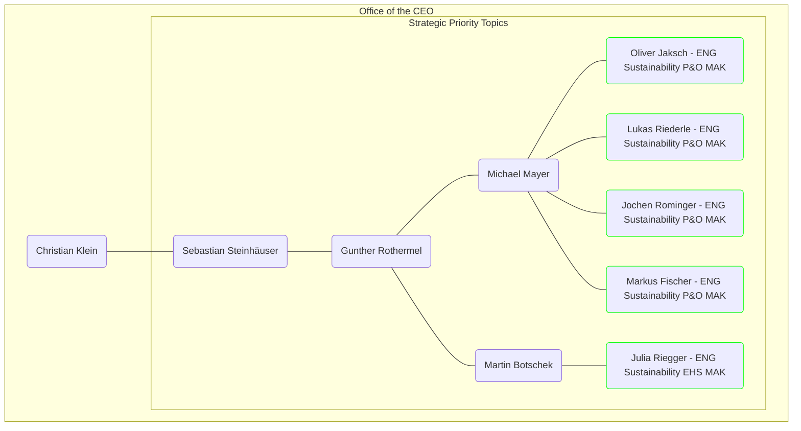
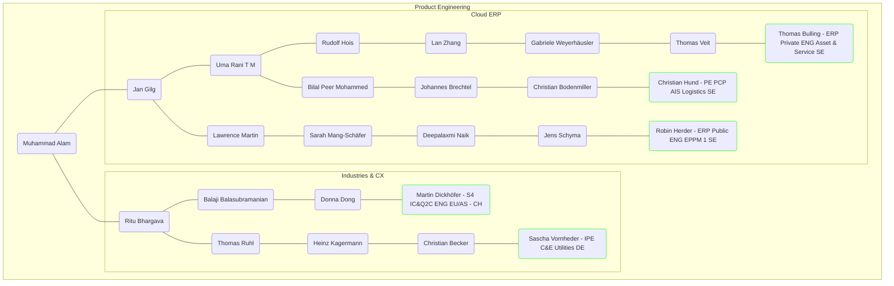
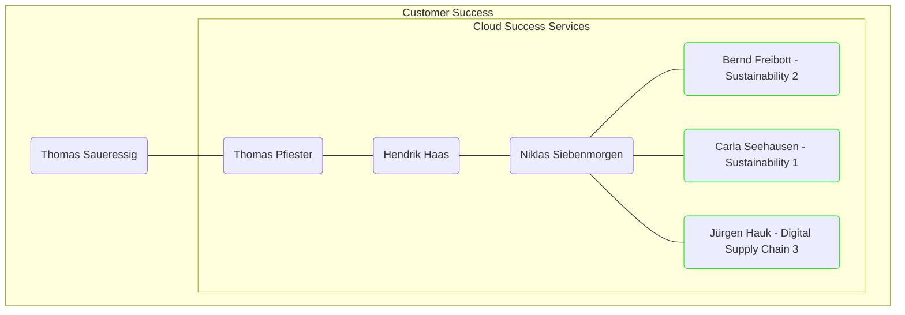

# Ansprechpartner Markdorf

## Ansprechpartner Praxisphasen

**Office of the CEO**

**Product Engineering**

**Customer Success**

**Hinweis**
Weitere Infos zu den Bereichen und den jeweiligen Ansprechpartner findet Ihr im Portal (_SAP One - Explore – Company – Whos Is Who & Org Chart_ und _SAP One - Explore – Plattforms – People_).

## Ansprechpartner Standort Markdorf
- Empfang: SAP GRF Emp MAK01 (mailto:sap_grf_emp_mak01@sap.com)
- IT: Ramo Doering (ramo.doering@sap.com)
- IT: Andreas Scherer (a.scherer@sap.com)
- Hausmeister: Thomas Hoess (thomas.hoess@sap.com)
- Standortleitung: Jochen Rominger (jochen.rominger@sap.com)
